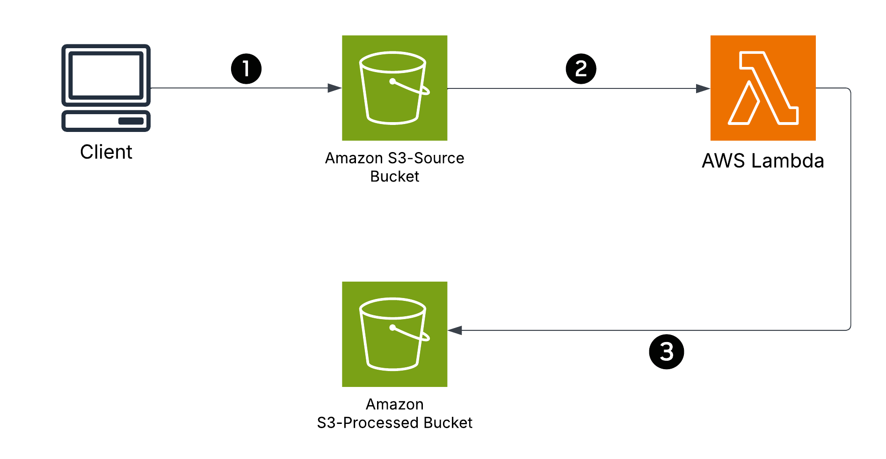

# AWS Serverless Image Processing with S3 and Lambda

# Solution Overview:
This solution provides a serverless image processing application where users upload their images to an Amazon S3 bucket. The S3 event automatically triggers an AWS Lambda function to process and resize the uploaded image, and then store the final version in another S3 bucket.

# Architecture Diagram:
The Serverless Image Processing solution supports a simple serverless architecture based on Amazon S3 and AWS Lambda:

1. Amazon S3 (Source Bucket): Users upload images to this bucket.
2. AWS Lambda Function: The event created in S3 automatically triggers the Lambda function. This function processes the image (resize or watermark) and stores it in the destination bucket.
3. Amazon S3 (Processed Bucket): The processed output is stored in this bucket.

# Deployment (Console Steps):
## 1. Create S3 Buckets

